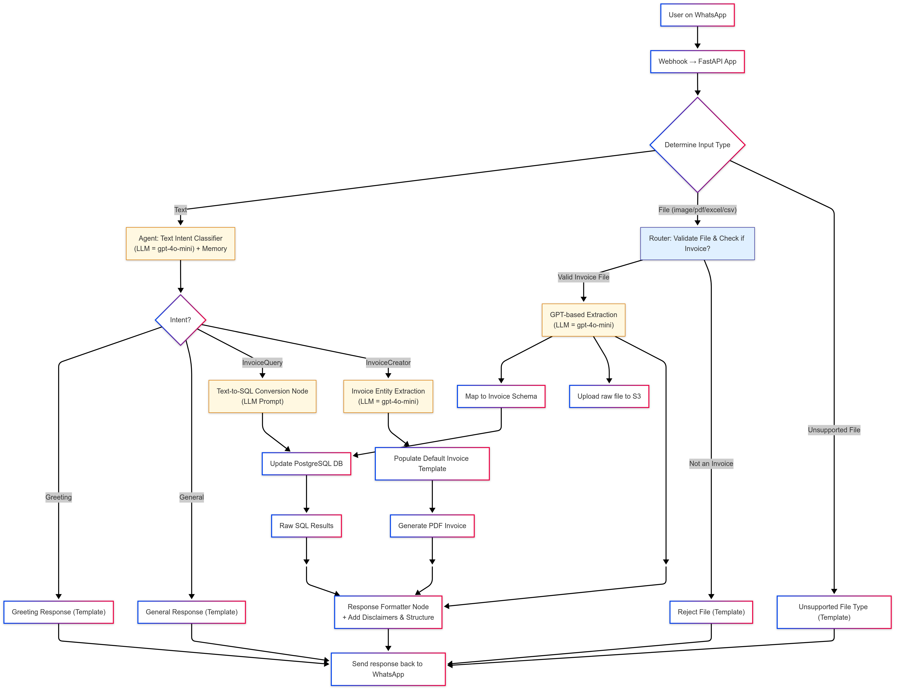
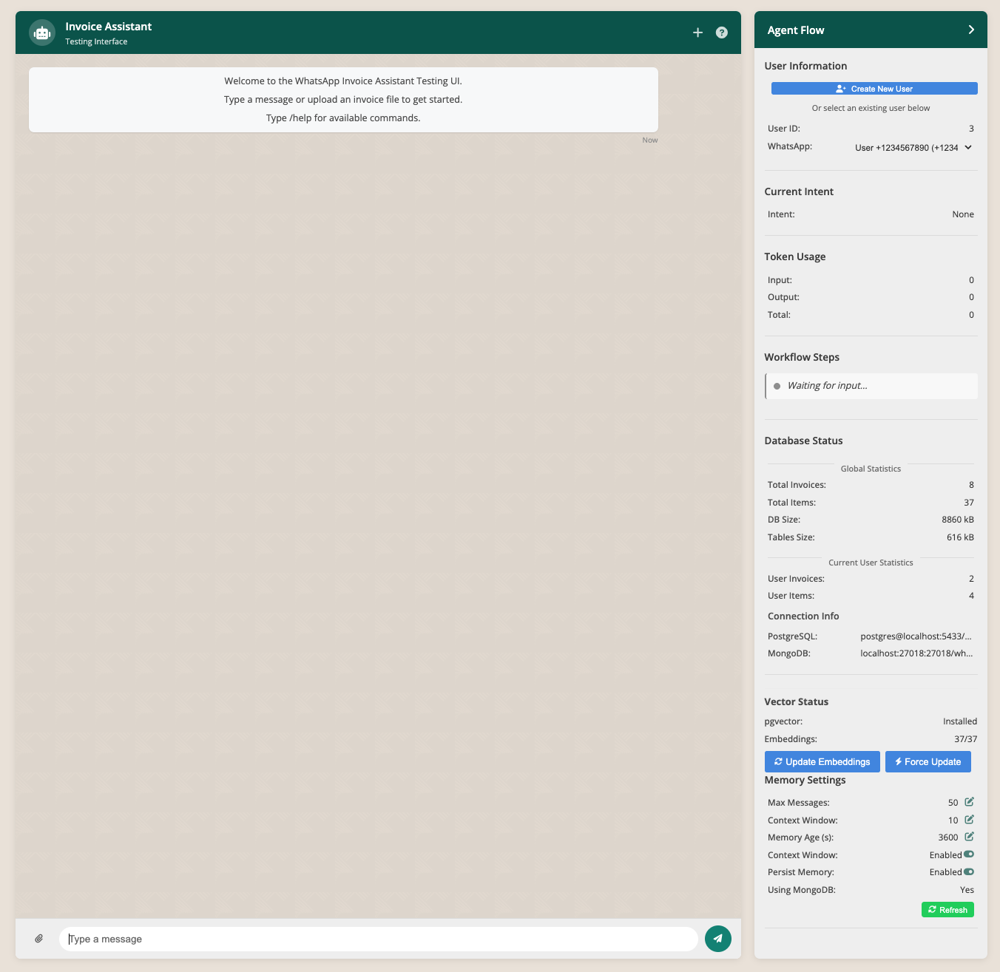

# WhatsApp Invoice Assistant

An AI-powered WhatsApp bot for processing and managing invoice data. The application allows users to upload invoices via WhatsApp, receive AI-generated summaries, and ask questions about their invoices using natural language.

## 🌟 Features

### Core Capabilities
- **Invoice Processing**: Upload and extract data from invoices in multiple formats (PDF, images, Excel, CSV)
- **Natural Language Queries**: Ask questions about your invoices in plain English
- **Semantic Search**: Find information even when you don't know exact terms or item names
- **WhatsApp Integration**: Interact with the system directly through WhatsApp
- **Multi-user Support**: Handle multiple users with separate data stores
- **Conversation Memory**: Remember context from previous interactions

### Technical Features
- **Vector Embeddings**: Semantic understanding of invoice data using pgvector
- **LangGraph Workflows**: Orchestrated AI agent workflows for different user intents
- **Hybrid Search**: Combines vector similarity and keyword matching for optimal results
- **Database Integration**: Structured storage with PostgreSQL and conversation memory with MongoDB
- **Cloud Storage**: AWS S3 integration for file storage
- **Containerization**: Docker and Kubernetes ready deployment

## 🛠️ System Architecture

The WhatsApp Invoice Assistant is built using a modular, agent-based architecture:

```
┌───────────────┐     ┌───────────────┐     ┌───────────────┐
│   WhatsApp    │     │   FastAPI     │     │   LangGraph   │
│  Integration  │────▶│  Application  │────▶│   Workflow    │
└───────────────┘     └───────────────┘     └───────────────┘
                                                   │
┌───────────────┐     ┌───────────────┐     ┌─────▼─────────┐
│   MongoDB     │◀────│ AI Processing │◀────│   Agents &    │
│   Memory      │     │    Nodes      │     │   Routers     │
└───────────────┘     └───────────────┘     └───────────────┘
                                                   │
┌───────────────┐     ┌───────────────┐     ┌─────▼─────────┐
│  PostgreSQL   │◀────│  Database     │◀────│   Response    │
│  + pgvector   │     │   Services    │     │   Formatters  │
└───────────────┘     └───────────────┘     └───────────────┘
```



## 📊 System Validation Summary

The system has been validated with the following results:

### Database Validation
- **PostgreSQL Version**: 14.17 (Homebrew)
- **pgvector Extension**: Installed and working (version 0.8.0)
- **Database Tables**: 9 tables properly configured with relationships
- **Vector Embeddings**:
  - 28 items with 1536-dimensional vector embeddings (100% coverage)
  - Vector columns in both `items` and `invoice_embeddings` tables
  - Functional L2 distance queries for semantic search

### Current Data
- 1 user in the system
- 5 invoices with metadata
- 28 line items with embeddings
- No conversations or messages yet
- Vector search queries working as expected
- Current migration: 6c0dda5c0543 (head)

For comprehensive documentation about database schema and vector search implementation, refer to the docs directory.

## 📚 Available Documentation

Detailed documentation is available in the `docs/` directory:

- **[DATABASE.md](docs/DATABASE.md)**: Database schema design and relationships
- **[MONGODB_MEMORY.md](docs/MONGODB_MEMORY.md)**: Memory management with MongoDB
- **[Query_Types.md](docs/Query_Types.md)**: Supported query types and processing flows
- **[PostgresSQL_Storage_Query.md](docs/PostgresSQL_Storage_Query.md)**: Database storage and query details
- **[TECH_STACK.md](docs/TECH_STACK.md)**: Complete technology stack overview
- **[VECTOR_SEARCH.md](docs/VECTOR_SEARCH.md)**: Vector embedding generation and semantic search implementation
- **[DOCKER.md](docs/DOCKER.md)**: Docker setup and configuration
- **[CHANGELOG.md](docs/CHANGELOG.md)**: Version history and changes

## 🚀 Getting Started

### Prerequisites

- Python 3.9+
- PostgreSQL with pgvector extension
- MongoDB (optional, for conversation memory)
- OpenAI API key
- AWS S3 bucket (optional, for file storage)
- Twilio account with WhatsApp integration

### Installation

1. Clone the repository:
   ```bash
   git clone https://github.com/yourusername/whatsapp-invoice-assistant.git
   cd whatsapp-invoice-assistant
   ```

2. Install dependencies with Poetry:
   ```bash
   make install
   ```

3. Set up environment variables in `.env` or use config/env.yaml:
   ```bash
   cp .env.example .env
   # Edit .env with your credentials
   ```

4. Set up the database:
   ```bash
   make db-migrate
   ```

5. Start the application:
   ```bash
   make start
   ```

### Database Setup

The WhatsApp Invoice Assistant uses two database systems for different purposes:

#### PostgreSQL
- **Purpose**: Primary data storage for invoices, items, users, and vector embeddings
- **Setup**: Uses Alembic migrations to create and update schema
- **Setup Command**: `make db-migrate`
- **Requirements**: 
  - PostgreSQL 12+ with pgvector extension
  - Connection string in `.env` file as `DATABASE_URL`

The migration process:
- Creates all necessary tables (users, invoices, items, conversations, etc.)
- Attempts to install the pgvector extension for vector similarity search
- Sets up proper relationships between tables
- Applies any pending schema changes

#### MongoDB
- **Purpose**: Conversation memory storage and context management
- **Setup**: No migration needed; connects and creates collections dynamically
- **Configuration**:
  - Set `USE_MONGODB=true` in `.env` (default)
  - Connection URI in `.env` as `MONGODB_URI` (defaults to `mongodb://localhost:27017/whatsapp_invoice_assistant`)
- **Memory Settings**: Configurable in `config/env.yaml` under `mongodb.memory` section

MongoDB is only required if you need conversation history persistence. The system can run without it, but will use in-memory storage that doesn't persist between restarts.

### Running the Test UI

For testing and development without WhatsApp integration:

```bash
make ui-run
```

This will start a web interface at http://localhost:5001 where you can:
- Send text messages to the assistant
- Upload invoice files for processing
- View conversation history
- Monitor AI agent workflows in real-time
- Check database and embedding statistics



The Testing Interface provides a user-friendly way to interact with the assistant:
- **Left Panel**: Chat interface for uploading invoices and asking questions
- **Right Panel**: Agent flow monitoring with real-time updates on:
  - User information and token usage
  - Current intent recognition
  - Workflow steps in progress
  - Database status and statistics
  - Vector embedding information

All supporting documentation is available in the `docs/` folder, including detailed explanations of the database schema, vector search implementation, query types, memory management, and deployment instructions.

## ⚙️ Configuration Options

The WhatsApp Invoice Assistant is highly configurable through environment variables or the `config/env.yaml` file:

### Core Configuration

| Parameter | Description | Default |
|-----------|-------------|---------|
| `OPENAI_API_KEY` | OpenAI API key for LLM access | Required |
| `DATABASE_URL` | PostgreSQL connection string | Required |
| `MONGODB_URI` | MongoDB connection string | mongodb://localhost:27017/whatsapp_invoice_assistant |
| `USE_MONGODB` | Enable MongoDB for memory | true |
| `S3_BUCKET_NAME` | AWS S3 bucket for file storage | - |

### Vector Search Configuration

Vector search uses pgvector with L2 distance metric. Key configurations in `constants/vector_search_configs.py`:

```python
# L2 distance threshold - higher values return more results
# With L2 distance, lower values mean more similar items
VECTOR_SIMILARITY_THRESHOLD = 1.3

# Search configuration
DEFAULT_VECTOR_SEARCH_CONFIG = {
    "similarity_threshold": VECTOR_SIMILARITY_THRESHOLD,
    "max_results": 10,
    "similarity_metric": "l2_distance",
    "hybrid_search": True,
    "boost_exact_matches": True
}
```

### LLM and Embedding Configuration

```yaml
# LLM Configuration (from config/env.yaml)
llm:
  provider: "openai"
  model: "gpt-4o-mini"
  temperature: 0.3
  max_tokens: 1000
  embedding_model: "text-embedding-3-small"
  embedding_dimension: 1536
```

### Memory Management

```yaml
# MongoDB Memory Configuration
mongodb:
  memory:
    max_messages: 50  # Maximum messages per conversation
    max_memory_age: 3600  # Maximum age in seconds (1 hour)
    message_window: 10  # Context window size
    enable_context_window: true
    persist_memory: true
```

## 📊 Database Schema

The system uses a relational database with the following core tables:

- **Users**: Store user information and preferences
- **Invoices**: Main invoice metadata (date, vendor, total)
- **Items**: Line items from invoices with descriptions
- **Conversations**: Track user conversation sessions
- **Messages**: Store individual message content for context
- **WhatsAppMessages**: Track delivery status of WhatsApp messages

Vector search is enabled through a special column:
```sql
-- Items table includes a vector column for semantic search
description_embedding VECTOR(1536)
```

## 📝 TODO Tasks

The following tasks are currently pending for implementation:

- Set up Twilio account and WhatsApp sandbox
- Implement WhatsApp messaging service
- Create webhook endpoint for WhatsApp integration
- Test WhatsApp integration with mock services

## 🛠️ Available Commands

The Makefile provides numerous helpful commands:

### Application Management
- `make start` - Start the application
- `make stop` - Stop running instances
- `make restart` - Restart the application
- `make ui-run` - Start the test UI

### Database Management
- `make db-migrate` - Run database migrations
- `make db-status` - Show database statistics
- `make db-seed` - Seed test data
- `make db-clean` - Reset the database
- `make update-embeddings` - Update vector embeddings for items

### Development Tools
- `make install` - Install dependencies
- `make dev` - Start development environment
- `make test` - Run all tests
- `make lint` - Check code quality
- `make format` - Format code with Black

### Docker
- `make docker-build` - Build Docker image
- `make docker-run` - Start with Docker
- `make docker-stop` - Stop Docker containers

## 📱 WhatsApp Integration

The system integrates with WhatsApp via Twilio's API:

1. **Webhook Endpoint**: Receives messages from WhatsApp
2. **Intent Classification**: Determines user intent (query, invoice upload, etc.)
3. **File Handling**: Processes images and documents sent via WhatsApp
4. **Response Formatting**: Formats AI responses for WhatsApp display
5. **Media Support**: Handles both text and media responses

## 📄 Invoice Creation

The system provides automated invoice creation capabilities:

1. **Multiple Templates**: Supports 6 different invoice types:
   - Service Invoice (DOCX)
   - Invoice Document (DOCX)
   - Billing Statement (XLSX)
   - Credit Note (XLSX)
   - Debit Note (XLSX)
   - Time & Material Invoice (XLSX)

2. **Template Selection**: The system automatically selects the appropriate template based on the user's request and invoice type.

3. **Intelligent Information Collection**:
   - Extracts needed information from user messages
   - Remembers previously provided user details
   - Prompts for missing required information
   - Stores user-specific information in database for future use

4. **Multi-format Output**:
   - Generates completed invoices in both PDF and original format (DOCX/XLSX)
   - Allows users to receive their preferred file format

5. **Memory Integration**:
   - Maintains context across the invoice creation process
   - Remembers user preferences for future interactions

## 📝 License

[MIT License](LICENSE) - This project is licensed under the MIT License - see the [LICENSE](LICENSE) file for details.

## 🤝 Contributing

Contributions are welcome! Please feel free to submit a Pull Request.

1. Fork the repository
2. Create your feature branch (`git checkout -b feature/AmazingFeature`)
3. Commit your changes (`git commit -m 'Add some AmazingFeature'`)
4. Push to the branch (`git push origin feature/AmazingFeature`)
5. Open a Pull Request

## 📞 Contact

For questions or support, please open an issue on this repository.