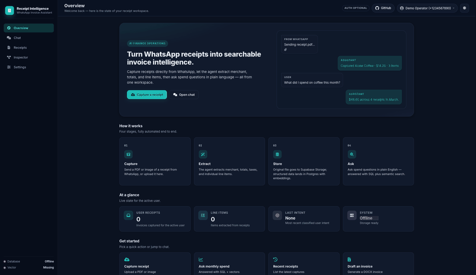
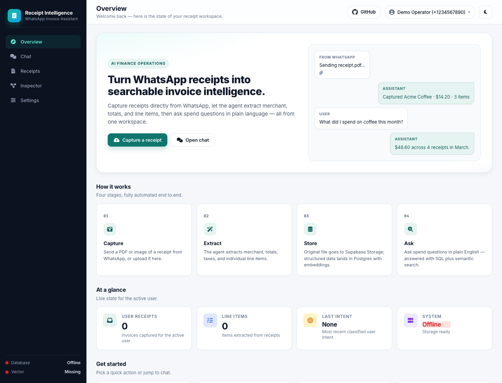
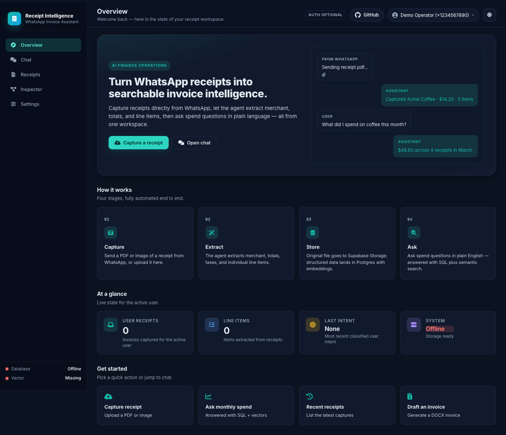
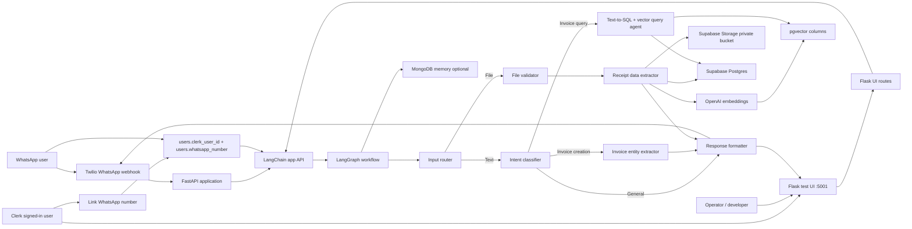
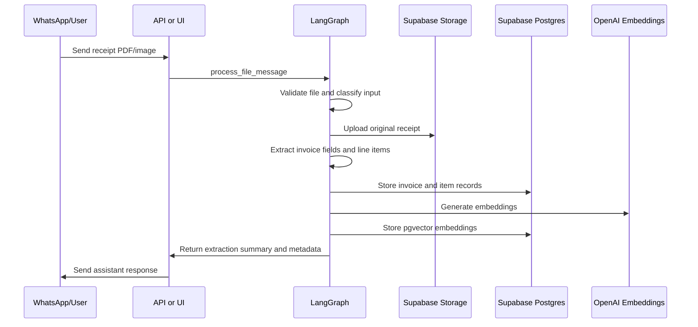

# WhatsApp Invoice Assistant

Production-oriented AI workspace for capturing receipts from WhatsApp, extracting invoice data, storing original receipt files, generating vector embeddings, and answering finance questions in natural language.

The application combines a WhatsApp webhook API, Clerk web authentication, LangGraph agent workflows, Supabase Postgres with pgvector, Supabase Storage, optional MongoDB memory, and an operator UI for local testing and workflow inspection.

## Live UI

[Open the hosted UI on Vercel](https://whatsapp-invoice-assistant.vercel.app)

The Vercel deployment runs the operator UI in demo mode so reviewers can inspect the product surface without private infrastructure. Full receipt extraction, WhatsApp webhook processing, Supabase persistence, and OpenAI embeddings require the production environment variables documented in [SETUP.md](SETUP.md).

## UI Demo

The repository includes a lightweight animated GIF so the product walkthrough renders directly in GitHub.



### Light Mode



### Dark Mode



## What This Application Does

- Captures invoice and receipt files from WhatsApp media messages or the local test UI.
- Links Clerk web users to WhatsApp numbers so receipts and insights stay scoped to one account across channels.
- Validates PDF and image uploads before processing.
- Extracts merchant, invoice metadata, totals, taxes, and line items.
- Stores original receipt files in Supabase Storage with signed URL access.
- Persists normalized invoice and item data in Supabase Postgres.
- Generates OpenAI embeddings and stores them in pgvector columns for semantic search.
- Routes user messages through LangGraph agents for upload, query, and invoice-creation workflows.
- Keeps conversation context in MongoDB when memory persistence is enabled.
- Provides a browser UI to simulate WhatsApp conversations, inspect workflow steps, and monitor database, storage, memory, and vector status.

## Use Case

Small businesses and operators can send receipts through WhatsApp, then ask questions such as:

- "What did I spend this month?"
- "Show the latest uploaded receipts."
- "How much did I spend on software subscriptions?"
- "Create an invoice for a new client."

The system is designed to preserve the original receipt file, normalize the extracted records, and make invoices searchable by both structured SQL and semantic similarity.

## Architecture


```mermaid
flowchart LR
    W["WhatsApp user"] --> T["Twilio WhatsApp webhook"]
    C["Clerk signed-in user"] --> UI
    C --> LINK["Link WhatsApp number"]
    LINK --> UMAP["users.clerk_user_id + users.whatsapp_number"]
    W --> UMAP
    O["Operator / developer"] --> UI["Flask test UI :5001"]

    T --> API["FastAPI application"]
    UI --> UIF["Flask UI routes"]
    UIF --> LAPI["LangChain app API"]
    API --> LAPI
    UMAP --> LAPI

    LAPI --> WF["LangGraph workflow"]
    WF --> R["Input router"]
    R -->|Text| IC["Intent classifier"]
    R -->|File| FV["File validator"]

    IC -->|Invoice query| SQL["Text-to-SQL + vector query agent"]
    IC -->|Invoice creation| IE["Invoice entity extractor"]
    IC -->|General| RF["Response formatter"]

    FV --> DE["Receipt data extractor"]
    DE --> ST["Supabase Storage private bucket"]
    DE --> PG["Supabase Postgres"]
    DE --> EMB["OpenAI embeddings"]
    EMB --> VEC["pgvector columns"]

    SQL --> PG
    SQL --> VEC
    IE --> RF
    DE --> RF
    RF --> T
    RF --> UI

    WF --> MEM["MongoDB memory optional"]
```

### Runtime Components

| Component | Purpose |
| --- | --- |
| FastAPI (`api/main.py`) | Production API surface and WhatsApp webhook endpoint. |
| Flask UI (`ui/app.py`) | Local operator UI for receipt upload, chat simulation, and workflow inspection. |
| Clerk (`utils/clerk_auth.py`) | Browser sign-in, session JWT verification, and account-to-WhatsApp linking. |
| LangGraph workflow (`langchain_app/`) | Routes text and files through specialized agent nodes. |
| Agents (`agents/`) | Intent classification, file validation, extraction, SQL/vector query generation, response formatting. |
| Supabase Postgres | Primary relational store for users, invoices, line items, messages, and embedding metadata. |
| pgvector | Semantic search over item descriptions and invoice embeddings. |
| Supabase Storage | Private receipt file storage with signed URLs generated on demand. |
| OpenAI | LLM and embedding provider. |
| MongoDB | Optional persistent conversation memory and LangGraph checkpoint storage. |
| Redis/Celery | Background-work infrastructure hooks for production deployments. |

## Receipt Upload Flow


```mermaid
sequenceDiagram
    participant User as WhatsApp/User
    participant API as API or UI
    participant Graph as LangGraph
    participant Storage as Supabase Storage
    participant DB as Supabase Postgres
    participant OpenAI as OpenAI Embeddings

    User->>API: Send receipt PDF/image
    API->>Graph: process_file_message
    Graph->>Graph: Validate file and classify input
    Graph->>Storage: Upload original receipt
    Graph->>Graph: Extract invoice fields and line items
    Graph->>DB: Store invoice and item records
    Graph->>OpenAI: Generate embeddings
    Graph->>DB: Store pgvector embeddings
    Graph->>API: Return extraction summary and metadata
    API->>User: Send assistant response
```

## Natural Language Query Flow

1. The user sends a finance question.
2. The text workflow classifies the intent.
3. Query intent is routed to the SQL and vector-search agent.
4. The agent builds a scoped query for the current user.
5. Supabase Postgres and pgvector return structured and semantic results.
6. The response formatter turns the result into a WhatsApp-ready answer.

## Identity Model

Clerk owns website authentication, while the application keeps `users.id` as the internal owner for invoices, media, messages, and embeddings. A user signs in on the web UI, selects **Link WhatsApp**, and enters the WhatsApp number they use for receipt uploads. The backend stores the Clerk subject in `users.clerk_user_id` on the row with the same `users.whatsapp_number`.

After linking, web uploads, WhatsApp uploads, dashboard counts, receipt lists, and semantic queries all resolve through the same internal `users.id`. If `CLERK_REQUIRE_AUTH=true`, the UI APIs reject receipt and insight access until the Clerk session is valid and linked to a WhatsApp number.

## Storage and Embeddings

This project uses Supabase Storage instead of S3 for receipt files because the application already depends on Supabase Postgres and pgvector. Supabase keeps receipt storage, signed URL generation, database records, and access policy management in one platform. The file handler stores only normalized metadata in Postgres and generates signed links when the UI or agent needs to display a file.

Embeddings are generated with OpenAI `text-embedding-3-small` and stored in pgvector-enabled columns. The application should fail clearly when embedding generation is unavailable rather than silently writing fake vectors.

## Quick Start

For full setup details, including where to get each environment variable, read [SETUP.md](SETUP.md).

```bash
git clone https://github.com/Abby263/whatsapp-invoice-assistant.git
cd whatsapp-invoice-assistant
cp .env.example .env
poetry install
PYTHONPATH=. poetry run alembic upgrade head
PYTHONPATH=. USE_MONGODB=false poetry run python ui/app.py --port 5001
```

Open `http://localhost:5001` for the operator UI.

## Required Services

| Service | Required | Used For |
| --- | --- | --- |
| Supabase project | Yes | Postgres, pgvector, receipt storage bucket, API keys. |
| OpenAI API key | Yes | LLM reasoning and embeddings. |
| Twilio WhatsApp sandbox or sender | Required for WhatsApp | Incoming WhatsApp text and media webhooks. |
| MongoDB | Optional | Persistent memory and workflow checkpoints. |
| Redis | Optional | Background task infrastructure. |
| Docker | Optional | Local containerized runtime. |

## Key Commands

```bash
# Install dependencies
make install

# Run database migrations
make db-migrate

# Start FastAPI webhook API
make start

# Start local UI
make ui-run

# Update embeddings
make update-embeddings

# Run tests
make test

# Start Docker stack
make docker-run
```

## Environment Summary

The most important variables are:

| Variable | Description |
| --- | --- |
| `DATABASE_URL` or `SUPABASE_DATABASE_URL` | Supabase Postgres connection string. |
| `SUPABASE_URL` | Supabase project URL. |
| `SUPABASE_SERVICE_ROLE_KEY` | Server-side Supabase key for private storage operations. |
| `SUPABASE_STORAGE_BUCKET` | Private receipt bucket name, default `receipts`. |
| `CLERK_PUBLISHABLE_KEY` or `NEXT_PUBLIC_CLERK_PUBLISHABLE_KEY` | Clerk browser key used to load the sign-in UI. |
| `CLERK_SECRET_KEY` | Clerk server key kept for production auth configuration. |
| `CLERK_REQUIRE_AUTH` | Set `true` to require sign-in and WhatsApp linking for web APIs. |
| `CLERK_AUTHORIZED_PARTIES` | Comma-separated allowed origins for Clerk token `azp` validation. |
| `OPENAI_API_KEY` | OpenAI API key. |
| `OPENAI_API_MODEL` | Chat model, default in this repo is `gpt-4o-mini`. |
| `TWILIO_ACCOUNT_SID` | Twilio account SID. |
| `TWILIO_AUTH_TOKEN` | Twilio auth token. |
| `TWILIO_PHONE_NUMBER` | Twilio WhatsApp-enabled sender. |
| `MONGODB_URI` | Optional MongoDB connection string. |
| `USE_MONGODB` | Set `true` for persistent memory, `false` for local UI-only testing. |

See [SETUP.md](SETUP.md) for exact source locations in Supabase, Clerk, OpenAI, and Twilio dashboards.

## Production Readiness Notes

- Keep Supabase service-role keys server-side only.
- Use private Supabase Storage buckets and signed URLs for receipt access.
- Restrict CORS in `api/main.py` before exposing the API publicly.
- Use HTTPS for the WhatsApp webhook URL.
- Run migrations before deploying a new app version.
- Configure structured logging and log retention for API, agent, and storage failures.
- Monitor failed extraction, storage upload, and embedding generation rates.
- Back up Supabase Postgres and MongoDB if memory persistence is enabled.
- Use queue workers for long-running extraction or embedding jobs at higher volume.

## Documentation

- [SETUP.md](SETUP.md): Full local and production setup guide.
- [docs/DATABASE.md](docs/DATABASE.md): Database schema and relationships.
- [docs/VECTOR_SEARCH.md](docs/VECTOR_SEARCH.md): pgvector search and embeddings.
- [docs/MONGODB_MEMORY.md](docs/MONGODB_MEMORY.md): Conversation memory behavior.
- [docs/TECH_STACK.md](docs/TECH_STACK.md): Technology stack.
- [docs/DOCKER.md](docs/DOCKER.md): Docker setup.
- [docs/Query_Types.md](docs/Query_Types.md): Supported query patterns.

## Repository Status

This repository is production-oriented but still requires real environment configuration before processing live WhatsApp traffic. The local UI can run in degraded mode without database connectivity so reviewers can inspect the workflow surface, but invoice upload, storage, semantic search, and WhatsApp responses require Supabase and OpenAI credentials.

## License

This repository is licensed under the [PolyForm Noncommercial License 1.0.0](LICENSE). It is available for noncommercial review, learning, evaluation, research, and contribution under the license terms.

Commercial use in any form is not permitted without a separate written commercial license from the copyright holder. This includes paid products, hosted services, client work, revenue-generating demos, resale, sublicensing, and use to support commercial operations.

AGPL was not used because AGPL permits commercial use; it only adds copyleft and network source-sharing obligations.
