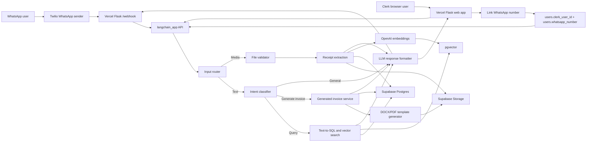

# WhatsApp Invoice Assistant

AI receipt and invoice workspace for WhatsApp-first operators. Users can send receipt images or PDFs to a Twilio WhatsApp number, link the same WhatsApp number to their Clerk web account, review extracted records in the web app, generate outgoing invoices, and ask finance questions over the stored data.

The production path runs on Vercel with Flask, Clerk, Twilio, Supabase Postgres, Supabase Storage, pgvector, and OpenAI.

## Live App

- Web app: [https://whatsapp-invoice-assistant.vercel.app](https://whatsapp-invoice-assistant.vercel.app)
- Twilio incoming-message webhook: [https://whatsapp-invoice-assistant.vercel.app/webhook](https://whatsapp-invoice-assistant.vercel.app/webhook)
- Repository: [https://github.com/Abby263/whatsapp-invoice-assistant](https://github.com/Abby263/whatsapp-invoice-assistant)

If production environment variables are missing, the hosted app falls back to demo mode so reviewers can still inspect the interface. Real WhatsApp processing requires the setup in [SETUP.md](SETUP.md).

## Demo


### Light Mode


### Dark Mode


## Product Capabilities

- Accepts WhatsApp text, image, and PDF messages through Twilio.
- Links Clerk web users to WhatsApp numbers so web and WhatsApp activity share one internal `users.id`.
- Extracts merchant, date, totals, taxes, payment details, and line items from receipts.
- Stores original receipt files in a private Supabase Storage bucket.
- Stores normalized invoice, item, media, message, user, and generated-invoice records in Supabase Postgres.
- Generates OpenAI embeddings and stores them in pgvector columns for semantic search.
- Answers user-scoped finance questions from extracted data.
- Generates outgoing invoices from WhatsApp or the website using saved seller/client defaults.
- Shows receipt, invoice, workflow, storage, database, and vector status in the UI.

Example WhatsApp prompts:

- `Hi`
- `What did I spend on coffee this month?`
- `Show my latest receipts.`
- `Create an invoice for Acme for $500 consulting due next Friday.`

## Architecture


```mermaid
flowchart LR
    W["WhatsApp user"] --> TW["Twilio WhatsApp sender"]
    TW --> WH["Vercel Flask /webhook"]
    B["Clerk browser user"] --> UI["Vercel Flask web app"]
    UI --> LINK["Link WhatsApp number"]

    WH --> API["langchain_app API"]
    UI --> API
    LINK --> USER["users.clerk_user_id + users.whatsapp_number"]
    USER --> API

    API --> ROUTER["Input router"]
    ROUTER -->|Text| INTENT["Intent classifier"]
    ROUTER -->|Media| VALIDATE["File validator"]

    VALIDATE --> EXTRACT["Receipt extraction"]
    EXTRACT --> STORE["Supabase Storage"]
    EXTRACT --> DB["Supabase Postgres"]
    EXTRACT --> EMB["OpenAI embeddings"]
    EMB --> VEC["pgvector"]

    INTENT -->|Query| SQL["Text-to-SQL and vector search"]
    SQL --> DB
    SQL --> VEC

    INTENT -->|Generate invoice| GEN["Generated invoice service"]
    GEN --> DOC["DOCX/PDF template generator"]
    DOC --> STORE
    GEN --> DB

    INTENT -->|General| RESP["LLM response formatter"]
    EXTRACT --> RESP
    SQL --> RESP
    GEN --> RESP
    RESP --> WH
    RESP --> UI
```

## Runtime Components

| Component | Purpose |
| --- | --- |
| [app.py](app.py) | Vercel Flask entrypoint for the hosted UI, `/webhook`, auth APIs, upload/chat routes, generated invoices, and health checks. |
| [ui/app.py](ui/app.py) | Local operator UI for development and workflow inspection. |
| [services/live_backend.py](services/live_backend.py) | Production bridge from Flask routes to Supabase, Clerk identity, Twilio media, receipt processing, and invoice generation. |
| [langchain_app/](langchain_app) | Text, file, query, and invoice-generation workflow routing. |
| [agents/](agents) | LLM-backed intent classification, validation, extraction, SQL generation, RAG, and response formatting. |
| [database/](database) | SQLAlchemy models, connection handling, CRUD helpers, and Alembic migrations. |
| [storage/supabase_storage_handler.py](storage/supabase_storage_handler.py) | Private Supabase Storage uploads and signed URL generation. |
| [services/generated_invoice_service.py](services/generated_invoice_service.py) | Generated invoice defaults, line items, document creation, storage, and analytics. |
| [utils/clerk_auth.py](utils/clerk_auth.py) | Clerk JWT verification and auth enforcement. |
| [memory/](memory) | In-memory conversation state with optional MongoDB persistence when explicitly enabled. |

## Data Model

The application stores user-scoped operational data in Supabase Postgres:

- `users`: Clerk identity, WhatsApp number, profile data, and invoice-generation defaults.
- `invoices`: extracted receipt or invoice header data.
- `items`: line items extracted from uploaded receipts.
- `media`: uploaded receipt metadata, content hashes, storage paths, and duplicate detection fields.
- `generated_invoices` and `generated_invoice_items`: outgoing invoices created from WhatsApp or the web app.
- `conversations`, `messages`, and `whatsapp_messages`: chat history and delivery metadata.
- pgvector embedding columns: semantic search over invoice and item content.

Uploaded receipt files and generated invoice documents are stored in the private Supabase Storage bucket configured by `SUPABASE_STORAGE_BUCKET`, defaulting to `receipts`. The database stores metadata and storage paths; the app generates signed URLs when users need to view a file.

## Why Supabase Storage Instead Of S3

The app already uses Supabase Postgres, pgvector, and server-side Supabase credentials. Keeping receipt files in Supabase Storage means private file storage, signed links, metadata, row ownership, and vector-backed analytics live in one platform. This repo no longer contains an active S3 storage path.

## Setup

Full setup lives in [SETUP.md](SETUP.md). The minimum production services are:

| Service | Required For |
| --- | --- |
| Supabase Postgres | Users, receipts, generated invoices, pgvector embeddings, and migrations. |
| Supabase Storage | Private receipt and generated-invoice document storage. |
| Clerk | Web sign-in and WhatsApp account linking. |
| Twilio WhatsApp | Incoming WhatsApp text and media messages. |
| OpenAI | LLM responses, extraction, image/PDF interpretation, and embeddings. |
| Vercel | Hosted Flask app and public HTTPS webhook. |

Core environment variables:

```bash
DATABASE_URL=postgresql://postgres.<project-ref>:<password>@aws-1-<region>.pooler.supabase.com:6543/postgres
DIRECT_URL=postgresql://postgres.<project-ref>:<password>@aws-1-<region>.pooler.supabase.com:5432/postgres
NEXT_PUBLIC_SUPABASE_URL=https://<project-ref>.supabase.co
NEXT_PUBLIC_SUPABASE_PUBLISHABLE_KEY=sb_publishable_...
SUPABASE_SECRET_KEY=sb_secret_...
SUPABASE_STORAGE_BUCKET=receipts

NEXT_PUBLIC_CLERK_PUBLISHABLE_KEY=pk_test_...
CLERK_SECRET_KEY=sk_test_...
CLERK_REQUIRE_AUTH=true
CLERK_AUTHORIZED_PARTIES=https://whatsapp-invoice-assistant.vercel.app

OPENAI_API_KEY=sk-proj-...
OPENAI_API_MODEL=gpt-5.4-mini

TWILIO_ACCOUNT_SID=AC...
TWILIO_AUTH_TOKEN=...
TWILIO_PHONE_NUMBER=whatsapp:+1...
```

The two `NEXT_PUBLIC_SUPABASE_*` values are not enough for this app by themselves. The server-side webhook also needs `DATABASE_URL`, `DIRECT_URL`, and `SUPABASE_SECRET_KEY` because it writes SQL records, stores private files, runs migrations, and creates signed URLs.

Validate local env values before testing:

```bash
python3 scripts/validate_env.py --env-file .env
```

## Local Development

```bash
git clone https://github.com/Abby263/whatsapp-invoice-assistant.git
cd whatsapp-invoice-assistant
cp .env.example .env
poetry install
PYTHONPATH=. poetry run alembic upgrade head
make ui-run
```

Open [http://localhost:5001](http://localhost:5001).

For production-style webhook testing, configure Twilio to call the deployed Vercel URL:

```text
https://whatsapp-invoice-assistant.vercel.app/webhook
```

## Common Commands

```bash
make install              # Install Python dependencies and pre-commit hooks
make ui-run              # Start the local Flask operator UI on port 5001
make db-migrate          # Run Alembic migrations
make db-status           # Check database connectivity
make update-embeddings   # Backfill or refresh pgvector embeddings
make test                # Run the pytest suite
```

## Testing Checklist

1. Run `python3 scripts/validate_env.py --env-file .env`.
2. Run `PYTHONPATH=. poetry run alembic upgrade head`.
3. Confirm [https://whatsapp-invoice-assistant.vercel.app/health](https://whatsapp-invoice-assistant.vercel.app/health) reports `backend_enabled=true`.
4. Sign in with Clerk on the website.
5. Use **Link WhatsApp** and enter the WhatsApp number that will message the Twilio sender.
6. Send `Hi` on WhatsApp and confirm the assistant responds.
7. Send a receipt image or PDF and confirm it appears in the web app.
8. Ask a question over the stored data, such as `What did I spend this month?`.
9. Generate an outgoing invoice and confirm it appears in generated invoices and analytics.

## Documentation

- [SETUP.md](SETUP.md): Production and local setup, env sourcing, Twilio webhook setup, and test plan.
- [docs/DATABASE.md](docs/DATABASE.md): Database schema and relationships.
- [docs/VECTOR_SEARCH.md](docs/VECTOR_SEARCH.md): pgvector and embedding behavior.
- [docs/TECH_STACK.md](docs/TECH_STACK.md): Current runtime stack and repository map.
- [CONTRIBUTING.md](CONTRIBUTING.md): Contribution workflow.

## License

This repository is licensed under the [PolyForm Noncommercial License 1.0.0](LICENSE). It is available for noncommercial review, learning, evaluation, research, and contribution under the license terms.

Commercial use in any form is not permitted without a separate written commercial license from the copyright holder. This includes paid products, hosted services, client work, revenue-generating demos, resale, sublicensing, and use to support commercial operations.

AGPL was not used because AGPL permits commercial use; it only adds copyleft and network source-sharing obligations.
