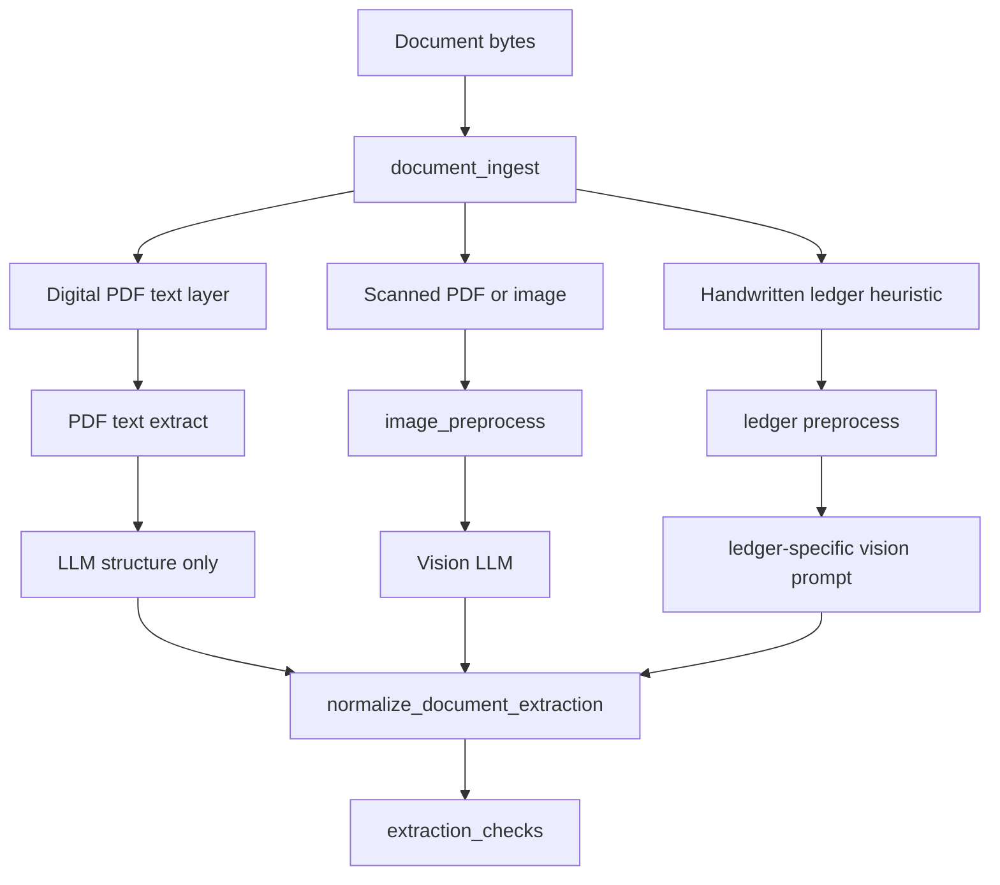

# OCR and Document Extraction Improvement Plan

This plan tracks the move from vision-only extraction toward a hybrid document
pipeline that separates document reading from business-structure extraction.

## Current State

The app is vision-LLM-first. Images are preprocessed and sent to a vision model,
then normalized into the canonical document schema. Before this plan, PDFs were
not read as PDFs; non-image binaries were reduced to a placeholder string such
as `Binary file: invoice.pdf, type: pdf, size: N bytes`.

| Input | Validation | Extraction | Gap |
| --- | --- | --- | --- |
| Images | Vision model plus image preprocessing | Vision model to JSON | Works for clear receipts; weaker on blur, skew, and handwriting |
| PDFs | Placeholder string for non-image binaries | Placeholder string to text LLM | Critical: no text layer or rendered pixels were inspected |
| Excel/CSV | Text/structured path | Text/structured prompt | Separate path; depends on parsed text |

Existing image support:

- `utils/image_preprocess.py`: EXIF rotation, resize, autocontrast, sharpen, JPEG output.
- `schemas/llm_outputs/document_extraction.py`: canonical schema normalization.
- `utils/extraction_checks.py`: deterministic quality warnings.
- `workflows/file_processing_workflow.py`: best-effort extraction when validation is uncertain.

## Target Architecture



Design principle: reading and understanding should be separate. Digital PDFs
should use a cheaper text-first path, while scanned PDFs and photos should use
vision on rendered or uploaded page images.

## Phase O1 - PDF Ingestion

Implemented first because it fixes the largest extraction gap.

- Added `utils/document_ingest.py`.
- Added `PyMuPDF` / `pymupdf` for Vercel-compatible PDF text extraction and page rendering.
- Digital PDFs are classified when page 1 has a readable text layer.
- Scanned PDFs render up to `PDF_MAX_PAGES` pages, default `3`, to PNG page images.
- `agents/data_extractor.py` now sends digital PDF text or rendered page images to extraction.
- `agents/file_validator.py` validates digital PDF text or the rendered first page instead of a placeholder.
- Extraction metadata records `ingest_kind`, `page_count`, `pages_processed`,
  `pdf_pages_processed`, and `ocr_sources`.

Acceptance criteria:

- Valid digital PDFs never send `Binary file: ...` as extraction input.
- Valid scanned PDFs are rendered and sent through the vision path.
- `PDF_MAX_PAGES` bounds cost and latency.
- WhatsApp review metadata can show how many PDF pages were read.

## Phase O2 - Image Quality

Planned next:

- Add `profile="receipt"|"ledger"` to `preprocess_image_bytes`.
- Use higher max edge and stronger thresholding for ledgers.
- Add `utils/image_quality.py` for blur, brightness, and blank-page checks.
- Surface quality warnings in WhatsApp review copy, for example: "Photo looks blurry - retake flat and well lit."

## Phase O3 - Hybrid OCR Mode

Configuration proposal:

```text
OCR_MODE=vision
OCR_MODE=hybrid
OCR_MODE=vision_with_ocr
OCR_PROVIDER=none|google|azure
```

Recommendation for the current Vercel deployment is to continue with PyMuPDF
text plus vision first, then add Google Document AI or Azure Document
Intelligence behind `OCR_PROVIDER` only when accuracy gains justify the vendor
setup and cost.

## Phase O4 - Handwritten Ledger Accuracy

Planned improvements:

- Add a ledger-specific prompt focused on row extraction and `DD.MM.YY` dates.
- Add row-count heuristics after extraction.
- Force `needs_review=true` when extracted rows are materially lower than visible rows.
- Keep ledger-like validation lenient so handwritten notebooks reach review instead of hard rejection.

## Phase O5 - Structured Checks

Planned hardening in `utils/extraction_checks.py`:

- Tax/GST consistency against subtotal and total.
- Currency symbol vs `financial.currency`.
- Duplicate line-item warning.
- Max item sanity cap with review warning.
- Reconciliation warnings when OCR and vision disagree.

## Benchmark Instructions

Create a golden dataset under `tests/fixtures/files/`:

| Fixture | Expected check |
| --- | --- |
| `valid_invoice.png` | Baseline image extraction |
| `invalid_invoice.png` | Rejection path |
| `blurry_receipt.jpg` | Quality warning |
| `handwritten_ledger.jpg` | Row count and date extraction |
| `digital_invoice.pdf` | Text-layer path |
| `scanned_invoice.pdf` | Render-to-vision path |

Expected outputs should live under `tests/fixtures/expected/*.json` with:

- vendor name
- transaction date
- currency
- total
- item count
- required quality warnings

Planned script:

```bash
PYTHONPATH=. poetry run python scripts/evaluate_extraction.py
PYTHONPATH=. poetry run python scripts/evaluate_extraction.py --live
```

The non-live CI mode should mock LLM responses and assert routing behavior,
especially that digital PDFs do not regress to the placeholder path. The live
mode can run locally with an API key to measure extraction precision/recall per
field.

## Operational Constraints

| Concern | Mitigation |
| --- | --- |
| Function size and cold start | Prefer PyMuPDF over Poppler/Tesseract |
| Timeout | Process max 3 PDF pages and keep Twilio ack-first behavior |
| Memory | Render and resize only the pages being processed |
| Cost | Use text-only extraction for digital PDFs |

## Implementation Order

1. O1 PDF ingest and rendered page extraction.
2. O2 image quality and preprocessing profiles.
3. O5 stronger deterministic checks and HITL metadata.
4. O4 ledger-specific path.
5. O3 optional external OCR provider.
6. O6 evaluation harness and golden dataset.
