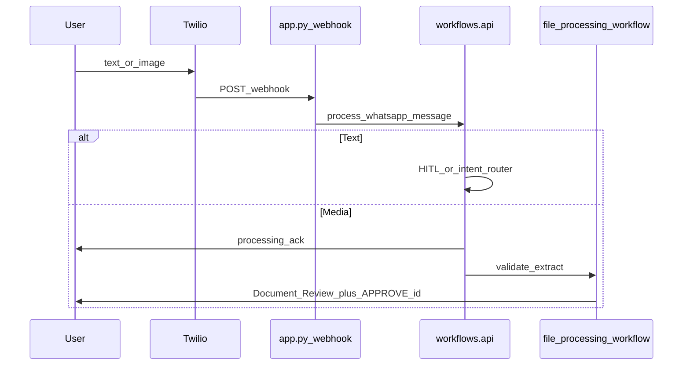
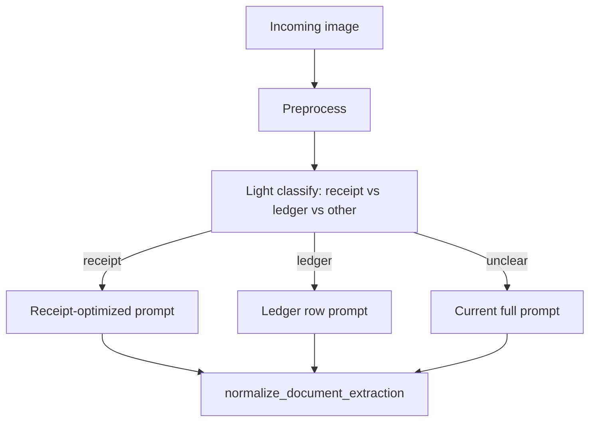

# WhatsApp Chat UX Improvement Plan

This plan complements the technical hardening roadmap. It focuses on what users see and do in WhatsApp, with implementation pointers in the existing codebase.

## Current WhatsApp UX (Baseline)



| Area | Today | Main files |
| --- | --- | --- |
| Message shaping | `compact_whatsapp_message` at 1400 chars, markdown `*bold*` | `services/conversation_policy.py` |
| Receipt summary | Document Review / Document Saved plus sample items and `APPROVE` / `REJECT` | `workflows/file_processing_workflow.py`, `format_extraction_response` |
| Rejection | Document Not Processed plus reason | `format_invalid_file_response` |
| Multi-file | Per-file messages or Batch Processing Result summary | `workflows/api.py`, `_combine_media_results` |
| Greeting/help | LLM via `ResponseFormatterAgent`; variable | `workflows/general_response_workflow.py` |
| Spend questions | SQL to format, optional RAG | `workflows/invoice_query_workflow.py` |
| Extraction | Vision LLM plus document processing prompt and schema normalization | `prompts/document_processing/invoice_data_extraction_prompt.txt`, `schemas/llm_outputs/document_extraction.py` |
| Handwritten fallback | Validator reject to best-effort second extraction pass | `workflows/file_processing_workflow.py`, lines 107-128 |

Pain points observed in code/docs:

- Users must type exact `APPROVE <id>`; there are no buttons, and LLM-only HITL parsing is fragile.
- Batch summary collapses detail; forwarded albums may arrive as many separate webhooks.
- Greeting/help is non-deterministic because it uses LLM-generated onboarding.
- Extraction quality warnings show only the first warning and at most four sample line items.
- Re-approve path may re-run vision, making approval slow and potentially inconsistent with the preview.
- Off-topic detection is keyword-based and can false-positive on general questions.

## UX Principles

- Two-message pattern: ack fast, result slow. Media already uses this; extend it consistently.
- One clear action per message, especially for HITL: what was found, what to reply, and what happens next.
- Stable copy over LLM prose for commands, errors, and onboarding. Reserve LLM for summaries and analytics answers.
- Show confidence honestly: `extraction_quality.needs_review` should change tone, such as "please verify totals", not just appear as a footnote.
- Never blame the user. Replace "invalid file" with "I couldn't read this as a receipt - try ...".

## Phase UX-1 - Conversation Design And Onboarding

### 1.1 Deterministic Help Menu

Change: add `build_help_message(user_context)` in `services/conversation_policy.py` or new `services/whatsapp_copy.py`.

```text
Receipt Intelligence
• Send a photo or PDF of a receipt or invoice
• Send a handwritten expense page (ledger)
• Ask: What did I spend on coffee this month?
• Create invoice for Acme, $500 consulting, due Friday

After upload you'll get APPROVE <id> / REJECT <id> to save.

Pending: 2 uploads waiting (reply STATUS)
```

Wire: `workflows/text_processing_workflow.py`. If normalized text is in `GREETING_TERMS` or is `help` / `menu`, return deterministic copy before the intent classifier.

Also align `constants/fallback_messages.py` `IntentType.HELP` with the same text.

### 1.2 STATUS Command

List pending uploads for this user from `media` where `hitl_status=awaiting_confirmation`.

```text
Pending uploads
1. Cafe receipt - ₹450 - APPROVE 77
2. Uber PDF - ₹320 - APPROVE 81
```

Implementation: new handler in `services/hitl_service.py` or `services/whatsapp_status.py`; query through existing history/media helpers in `services/history_service.py`.

### 1.3 Contextual Follow-Ups After Save

After approve, append one line:

```text
Saved as receipt #142. Try: "Show my latest receipts" or "Total spend this month"
```

Wire: `services/hitl_service.py`, `_approve_pending_extraction_payload` response builder.

### 1.4 Soften Off-Topic Handling

Change `services/conversation_policy.py` `is_off_topic_message` to require an off-topic term and absence of finance terms. Reply with "I'm focused on receipts..." plus examples instead of a hard stop.

## Phase UX-2 - Image And PDF Extraction Quality

### 2.1 Pre-Processing Pipeline

Add `utils/image_preprocess.py`.

| Step | Purpose |
| --- | --- |
| Auto-rotate with EXIF | Fix sideways phone photos |
| Resize max edge 2048px | Faster processing and safer vision input sizes |
| Contrast/sharpen with Pillow | Improve handwritten ledgers |
| PDF: render page 1 at 200 DPI | Consistent vision input |

Call from `agents/data_extractor.py` and `agents/file_validator.py` before base64 upload.

### 2.2 Two-Stage Extraction For Images



Split prompts: keep `invoice_data_extraction_prompt.txt`; add `ledger_extraction_prompt.txt` with row-table focus.

Classify with a cheap vision call or validator metadata, such as a `document_type` hint.

### 2.3 Post-Extraction Validation

After `normalize_document_extraction`, run `utils/extraction_checks.py`:

- Compare `sum(items.total_price)` with `financial.total`, tolerance 5%.
- Flag missing date on non-ledger documents.
- Flag zero items with a non-zero total.

If checks fail, set `needs_review=true` and add a human-readable warning used in WhatsApp copy:

```text
Quality: Line items add up to ₹1,200 but total shows ₹1,450 - please verify before approving.
```

Wire: `workflows/file_processing_workflow.py`, `_document_response_fields` and `format_extraction_response`.

### 2.4 Validator Tuning

| Issue | Change |
| --- | --- |
| Handwritten ledgers rejected | Lower validator threshold when best-effort path exists; prefer "review" over "reject" |
| Bank transfers / tickets | Keep strict reject but provide a specific reason in `format_invalid_file_response` |
| Blurry image | If `confidence_score < 0.5`, say "Photo is blurry - retake with flat lighting" |

Files: `agents/file_validator.py`, `constants/fallback_messages.py`, `FILE_VALIDATION_PROMPTS`.

### 2.5 Multi-Page PDFs

UX plan:

- Process first `N` pages, with config `PDF_MAX_PAGES=3`.
- WhatsApp reply: "Processed pages 1-3 of 5. Send remaining pages if needed."
- Store page count in `processing_metadata`.

### 2.6 Approve Uses Reviewed Data

Use cached `pending_extraction_result` on approve so the WhatsApp summary matches saved analytics. This reduces "it changed after I approved" distrust.

## Phase UX-3 - HITL Approval Experience

### 3.1 Deterministic Commands

Regex `APPROVE 77` / `REJECT 77` before LLM so approvals work first try.

### 3.2 Richer Review Card

Enhance `format_extraction_response` and keep it under roughly 1000 chars:

```text
Document Review
Upload #77 · Cafe Landwer · 18 May 2026
Total: ₹1,450 · 8 items · Quality: 7/8 rows read

Top items:
1. Latte — ₹120
2. Sandwich — ₹280
… +6 more

⚠ Totals may not match line items — check before approving.

Reply APPROVE 77 to save
Reply REJECT 77 to discard
```

Rules:

- Show `upload_id` prominently.
- Show extracted/visible row counts from `extraction_quality`.
- If `needs_review`, put warning above action lines.

### 3.3 Approve/Reject Confirmation

Use short confirmations:

```text
Saved - receipt #142 (Cafe Landwer, ₹1,450)
Discarded upload #77. Nothing was added to your spending.
```

### 3.4 Optional Twilio Quick-Reply Buttons

If Twilio Content API/buttons are enabled, send:

- Button "Approve", payload `APPROVE 77`
- Button "Reject", payload `REJECT 77`

Document this in `SETUP.md` as optional. Keep text commands as fallback.

## Phase UX-4 - Multi-Image And Batch UX

### 4.1 Per-File Messages Vs Batch Summary

| Scenario | Behavior |
| --- | --- |
| Single attachment | Full Document Review card |
| 2-5 in one webhook | Individual cards plus one-line batch footer |
| 6+ in one webhook | Batch summary plus "Reply STATUS for per-file commands" |
| Forwarded album in separate webhooks | Same as single; optional dedupe message "Received 3 of ~6 images..." |

Change: `workflows/api.py` `_combine_media_results` should include per-file `APPROVE` id lines in batch, not only counts.

### 4.2 Progress For Long Batches

For `N > 3`, after ack, send intermediate "Processed 2/5..." messages via outbound Twilio. Reuse `services/twilio_messaging.py`.

### 4.3 Duplicate UX

When duplicate detected, message should say which prior upload matched:

```text
Duplicate of upload #64 (same receipt, 18 May). Nothing new saved.
```

## Phase UX-5 - Spend Questions And Invoice Creation

### 5.1 Query Answers: Structure Over Prose

`agents/response_formatter.py` local formatters are a good base. Enforce a template for SQL/RAG:

```text
Spend this month
Total: ₹12,400 across 18 receipts

Top categories:
• Food - ₹4,200
• Transport - ₹2,100

Based on 18 approved receipts through 18 May 2026.
```

Always state data scope, such as approved-only data and inferred date range.

If there are zero rows, suggest: "Upload a receipt or approve pending uploads (STATUS)."

### 5.2 Clarifying Questions

When intent is ambiguous in `agents/text_intent_classifier.py`, reply:

```text
Did you mean:
1. Spending on coffee this month
2. Your latest coffee receipt
Reply 1 or 2, or rephrase.
```

### 5.3 Invoice Creation Wizard

Use multi-turn state in `processing_metadata` or lightweight `conversation.state` JSON:

- Client name
- Amount / line items
- Due date
- Confirm, then generate

Wire: `workflows/invoice_creator_workflow.py`. Detect incomplete payloads and ask for one missing field per message.

## Phase UX-6 - Errors, Latency, And Trust

| Situation | User message | Implementation |
| --- | --- | --- |
| Backend down | "Service is temporarily unavailable. Try again in a few minutes." | `app.py` webhook 503 |
| OpenAI rate limit | "Busy right now - I'll retry. Or resend in 1 minute." | Retry with backoff in `services/llm_factory.py` |
| Storage down | "Saved summary only - approve when storage is back, or resend." | Already partial; make copy explicit |
| Processing >25s | Ack already sent; final message when done | Outbound final reply flag |
| Generic error | Do not expose `str(exc)` to user | Technical plan Phase 1.4 |

Trust signals: include `upload_id`, receipt number, and "approved data only" in analytics answers.

## Phase UX-7 - Localization And Accessibility

- Currency: INR default already exists in schema. Detect `₹`, `Rs`, and `$` in extraction and display consistently through `_format_money`.
- Hindi/Hinglish: prompts already preserve mixed text. Add Hindi UI strings for help/HITL through config `WHATSAPP_LOCALE=en|hi`.
- Accessibility: avoid emoji-only status. Keep text labels such as `Status: Pending approval`.

## Metrics

Track in `processing_metadata` or a small `analytics_events` table.

| Metric | Target |
| --- | --- |
| Upload to approve rate | Increase |
| Reject rate after review | Stable or lower |
| Invalid file / resend rate | Decrease |
| Avg messages to complete invoice create | Decrease |
| Query no-results follow-up rate | Decrease |
| Time to first useful reply, p95 | < 15s text, < 45s single image |

## Suggested Implementation Order

| Order | Item | Depends on |
| --- | --- | --- |
| 1 | Create `docs/WHATSAPP_UX.md` and help/STATUS copy | None |
| 2 | Deterministic greeting/help plus HITL regex | Technical Phase 1.2 |
| 3 | Richer review card plus post-save hints | None |
| 4 | Cached approve so summary equals saved data | Technical Phase 2 |
| 5 | Image preprocess plus extraction checks | None |
| 6 | Ledger-specific prompt plus classify | None |
| 7 | Batch/duplicate message improvements | None |
| 8 | Query templates plus invoice wizard | None |
| 9 | Twilio buttons | Twilio config |

## Files To Touch

| File | UX changes |
| --- | --- |
| `docs/WHATSAPP_UX.md` | New living UX plan |
| `services/conversation_policy.py` | Help, STATUS copy, off-topic handling |
| `services/whatsapp_copy.py` | New centralized strings |
| `workflows/file_processing_workflow.py` | Review card, quality lines, reject copy |
| `workflows/api.py` | Batch summaries, progress |
| `services/hitl_service.py` | STATUS, confirmations |
| `agents/file_validator.py` | Reasons, ledger leniency |
| `agents/data_extractor.py` | Preprocess hook |
| `prompts/document_processing/` | Ledger prompt, examples |
| `schemas/llm_outputs/document_extraction.py` | Validation helpers |
| `agents/response_formatter.py` | Query/invoice templates |
| `utils/image_preprocess.py` | New image preprocessing |
| `utils/extraction_checks.py` | New extraction checks |

## Relationship To Technical Plan

| Technical item | UX benefit |
| --- | --- |
| HITL regex parsing | Approvals work first try |
| Cached extraction on approve | Preview matches saved data |
| Webhook idempotency | No duplicate review messages |
| Safe error messages | Less confusion on failures |
| `.vercelignore` fix | Reliable production UX |
